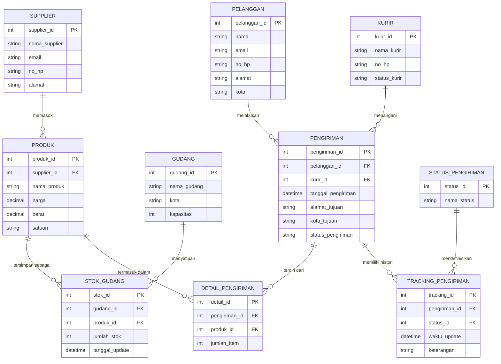

# 📦 Warehouse & Logistics Marketplace — Database Design

Studi kasus perancangan database untuk sistem manajemen **warehouse & logistics** pada platform marketplace dengan jaringan gudang di berbagai kota. Mencakup desain skema relasional (ERD), pembuatan **VIEW** untuk kebutuhan dashboard/reporting, dan strategi **INDEX** untuk optimasi performa pada skala data besar (jutaan baris).

> Dibuat sebagai dokumentasi jawaban studi kasus database — disusun ulang dalam format siap pakai untuk diuji langsung di MySQL/MariaDB (XAMPP) maupun dibaca sebagai referensi desain.

---

## 📋 Daftar Isi

- [Entity Relationship Diagram](#-entity-relationship-diagram)
- [Soal 1 — Tabel Relasi](#soal-1--tabel-relasi)
- [Soal 2 — Dashboard Harian](#soal-2--dashboard-harian)
- [Soal 3 — Evaluasi Performa Pengiriman](#soal-3--evaluasi-performa-pengiriman)
- [Soal 4 — Laporan Gudang](#soal-4--laporan-gudang)
- [Soal 5 — Pelanggan Prioritas](#soal-5--pelanggan-prioritas)
- [Soal 6 — Monitoring Real-Time](#soal-6--monitoring-real-time)
- [Soal 7 — Diagnosis & Optimasi Skala Besar](#soal-7--diagnosis--optimasi-skala-besar)
- [Soal 8 — Rancangan Arsitektur Database](#soal-8--rancangan-arsitektur-database)


---

## 🗺️ Entity Relationship Diagram



*(Diagram di atas otomatis ter-render oleh GitHub karena memakai blok kode `mermaid`.)*

---

## 🚀 Cara Menjalankan

### Via XAMPP / phpMyAdmin
1. Nyalakan **Apache** dan **MySQL** di XAMPP Control Panel.
2. Buka `http://localhost/phpmyadmin`.
3. Tab **Import** → jalankan berurutan: `01_schema.sql` → `02_views.sql` → `03_indexes.sql`.
4. Klik database `warehouse_logistics_db` → tab **Designer** untuk melihat relasi tabel secara visual.

### Via terminal (MySQL/MariaDB CLI)
```bash
mysql -u root -p < sql/01_schema.sql
mysql -u root -p warehouse_logistics_db < sql/02_views.sql
mysql -u root -p warehouse_logistics_db < sql/03_indexes.sql
```

---

| Tabel "1" | Tabel "N" | FK | Tipe Relasi |
|---|---|---|---|
| `supplier` | `produk` | `produk.supplier_id` | One-to-Many |
| `gudang` | `stok_gudang` | `stok_gudang.gudang_id` | One-to-Many |
| `produk` | `stok_gudang` | `stok_gudang.produk_id` | One-to-Many |
| `pelanggan` | `pengiriman` | `pengiriman.pelanggan_id` | One-to-Many |
| `kurir` | `pengiriman` | `pengiriman.kurir_id` | One-to-Many |
| `pengiriman` | `detail_pengiriman` | `detail_pengiriman.pengiriman_id` | One-to-Many |
| `produk` | `detail_pengiriman` | `detail_pengiriman.produk_id` | One-to-Many |
| `pengiriman` | `tracking_pengiriman` | `tracking_pengiriman.pengiriman_id` | One-to-Many |
| `status_pengiriman` | `tracking_pengiriman` | `tracking_pengiriman.status_id` | One-to-Many |

**Relasi Many-to-Many** (secara bisnis, diselesaikan lewat tabel asosiasi):

| Tabel A | Tabel B | Diselesaikan lewat |
|---|---|---|
| `gudang` | `produk` | `stok_gudang` |
| `pengiriman` | `produk` | `detail_pengiriman` |
| `pengiriman` | `status_pengiriman` | `tracking_pengiriman` |

> Setiap FK di database selalu bersifat *one-to-many* secara teknis — itulah sebabnya `stok_gudang`, `detail_pengiriman`, dan `tracking_pengiriman` ada sebagai *junction table* untuk merepresentasikan relasi *many-to-many* secara bisnis.

**Catatan desain:** kolom `pengiriman.status_pengiriman` menyimpan status terkini secara langsung (denormalisasi untuk akses cepat), sementara `status_pengiriman` (master) + `tracking_pengiriman` (histori) menyimpan jejak audit lengkap setiap perubahan status.

---

## Soal 2 — Dashboard Harian

**a. Tabel:** `pengiriman`, `kurir`, `detail_pengiriman`, `produk`

**b-c. Query & VIEW** — lihat [`sql/02_views.sql`](sql/02_views.sql): `vw_pengiriman_harian`, `vw_produk_terkirim_harian`

> ⚠️ Query contoh di bawah memakai pola `tanggal_pengiriman >= CURDATE() AND tanggal_pengiriman < CURDATE() + INTERVAL 1 DAY`, **bukan** `WHERE DATE(tanggal_pengiriman) = CURDATE()` — lihat [Catatan Validasi Teknis](#-catatan-validasi-teknis) untuk bukti EXPLAIN mengapa ini penting.

**d-e. Index & alasan** — lihat [`sql/03_indexes.sql`](sql/03_indexes.sql):
- `idx_pengiriman_tanggal` — filter rentang tanggal hari ini di semua metrik (terbukti dipakai lewat EXPLAIN, lihat catatan validasi)
- `idx_pengiriman_status`, `idx_pengiriman_kota_tujuan` — kolom `GROUP BY`
- `idx_pengiriman_kurir` — FK join ke kurir
- `idx_detail_pengiriman_produk`, `idx_detail_pengiriman_pengiriman` — join ganda untuk metrik produk paling sering dikirim

---

## Soal 3 — Evaluasi Performa Pengiriman

**a. Tabel:** `pengiriman`, `tracking_pengiriman`, `status_pengiriman`, `kurir`

**b. Query inti** (rata-rata waktu pengiriman):
```sql
SELECT AVG(TIMESTAMPDIFF(HOUR, p.tanggal_pengiriman, t.waktu_update)) AS rata2_jam_pengiriman
FROM pengiriman p
JOIN tracking_pengiriman t ON p.pengiriman_id = t.pengiriman_id
JOIN status_pengiriman s ON t.status_id = s.status_id
WHERE s.nama_status = 'Sampai';
```

**c. VIEW:** `vw_waktu_pengiriman`, `vw_performa_kurir`

**d. Index:** `idx_tracking_pengiriman_status (pengiriman_id, status_id)` — composite agar pencarian status "Sampai"/"Gagal" per pengiriman tidak full-scan tabel tracking yang besar.

---

## Soal 4 — Laporan Gudang

**a. Tabel:** `gudang`, `stok_gudang`, `produk`

**b. VIEW:** [`vw_laporan_gudang`](sql/02_views.sql) — total stok, jumlah produk unik, dan utilisasi (`total_stok / kapasitas`) per gudang dalam satu view (pakai `LEFT JOIN` agar gudang kosong tetap tampil).

**c-d. Index & dampak:** `idx_stok_gudang_komposit (gudang_id, produk_id)` mengubah agregasi dari *full scan* O(n) menjadi *index seek* mendekati O(log n), sekaligus mempercepat `COUNT(DISTINCT produk_id)` karena data sudah terurut di B-Tree index.

---

## Soal 5 — Pelanggan Prioritas

**a. Tabel:** `pelanggan`, `pengiriman`, `detail_pengiriman`

**b-c. VIEW:** [`vw_pelanggan_prioritas`](sql/02_views.sql) — total pengiriman, total item terkirim, dan aktivitas 30 hari terakhir per pelanggan, dipakai ulang oleh tim BI.

**d. Index:** `idx_pengiriman_pelanggan_tanggal (pelanggan_id, tanggal_pengiriman)` — composite, mendukung filter per pelanggan **dan** rentang tanggal sekaligus.

---

## Soal 6 — Monitoring Real-Time

Skala: **5 juta pengiriman, 20 juta data tracking**.

**a. VIEW:** [`vw_monitoring_realtime`](sql/02_views.sql) — mengambil status terkini langsung dari kolom `pengiriman.status_pengiriman` (bukan window function ke seluruh tabel tracking), waktu update lewat subquery `MAX()` yang sempit per `pengiriman_id`.

**c-d. Index kunci:** `idx_tracking_pengiriman_waktu (pengiriman_id, waktu_update)` berfungsi sebagai **covering index** untuk subquery `MAX(waktu_update)`, sehingga tabel tracking 20 juta baris tidak perlu disentuh langsung untuk setiap baris monitoring.

---

## Soal 7 — Diagnosis & Optimasi Skala Besar

Skala: **1 juta pelanggan, 500 ribu produk, 10 juta pengiriman, 50 juta tracking**. Laporan histori >5 menit.

**a. Penyebab utama:** tidak ada index pada kolom filter (`pelanggan_id`, `tanggal_pengiriman`), `SELECT *` tanpa pagination, VIEW dihitung ulang setiap panggilan, tidak ada partisi tabel pada `tracking_pengiriman`.

**b. VIEW:** [`vw_histori_pengiriman_pelanggan`](sql/02_views.sql) — wajib dipanggil dengan filter + `LIMIT`, bukan tanpa batas.

**c-e.** Minimal 5 index (lihat [`sql/03_indexes.sql`](sql/03_indexes.sql)) diperkirakan menurunkan waktu eksekusi dari >5 menit ke kisaran **ratusan ms – beberapa detik**, dengan trade-off overhead kecil pada `INSERT`/`UPDATE`. Untuk pertumbuhan lebih jauh, disarankan tambahan **table partitioning** per bulan/tahun dan **archiving** data lama.

---

## Soal 8 — Rancangan Arsitektur Database

Sebagai *Database Architect*, dirancang 4 dashboard (operasional, gudang, kurir, pelanggan) dengan:

- **VIEW:** `vw_dashboard_operasional`, `vw_dashboard_gudang`, `vw_dashboard_kurir`, `vw_dashboard_pelanggan` (lihat [`sql/02_views.sql`](sql/02_views.sql))
- **Index:** 7 index inti (lihat [`sql/03_indexes.sql`](sql/03_indexes.sql))
- **Query JOIN 4+ tabel:** laporan detail pengiriman lengkap (5 tabel), laporan stok dengan supplier (4 tabel), histori pengiriman lengkap (5 tabel)

**Hubungan VIEW, JOIN, dan INDEX:**
- **JOIN** menggabungkan data antar tabel ternormalisasi menjadi hasil yang bermakna bisnis.
- **VIEW** membungkus logika JOIN/agregasi yang kompleks menjadi objek yang dipakai berulang, menjaga konsistensi logika bisnis di semua laporan.
- **INDEX** membuat JOIN dan VIEW tersebut tetap cepat saat data bertumbuh dari ribuan ke jutaan baris.

> JOIN menentukan *apa* yang digabungkan, VIEW menentukan *bagaimana logika itu disederhanakan untuk dipakai ulang*, dan INDEX menentukan *seberapa cepat* semua itu bisa dieksekusi.

---

## 📝 Lisensi

Proyek ini dibuat untuk tujuan pembelajaran/studi kasus desain database. Bebas digunakan, dimodifikasi, dan dibagikan ulang.
